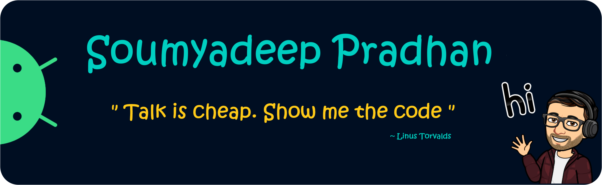

## Hello World! 👋🏻👨🏻‍💻

<a href="https://heysoumyadeep.github.io/"><a/>

  
---

          <!----> 

---

#### I'm a student from India, currently studying at RCC Institute of Information and Technology pursuing B.Tech in Computer Science & Engineering field.
  
#### 🌱 I’m currently learning Full Stack Dev. 
  
---

 <a href="https://github.com/heysoumyadeep/">  <a/> 

 
---
  
<h2 align="center">Support me @
  
</h2>
 
---

 <a href="https://gpvc.arturio.dev/heysoumyadeep">  <a/>

<!--
  -->
<!--
  -->
<!--
 -->
