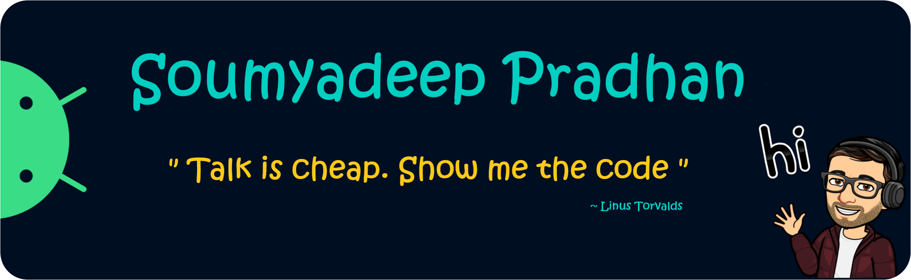

## Hello World! 👋🏻👨🏻‍💻

  

---

### Quick Intro:

#### 🏫 Not from IIT/NIT/IIIT or any of the Tier 1/Tier 2 Colleges.
#### 🌱 Software Developer, currently working at JPMorgan Chase & Co., India.
#### 🎶 Love to Sing and Vibe.
#### 📺 Spend most of my time doing Netflix & Chill.
#### 🏔️ If you have plans for Trekking, I'm in.

---

### 🛠️ Tech Stack

  
  
  
  
  
  
  
  
  
  
  
  
  
  
  
  
  
  
  
  
  
  
  
  
  
  
  
  
  
  
  
  
  
  
  
  
  
  

---

### 🔗 Find Me On

  
  
  
  

---

### 📊 GitHub Stats

  
  

